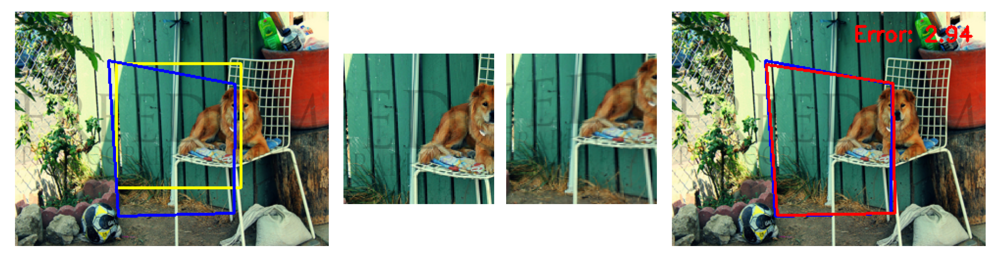
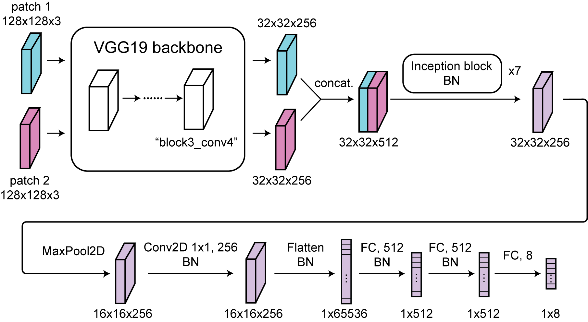
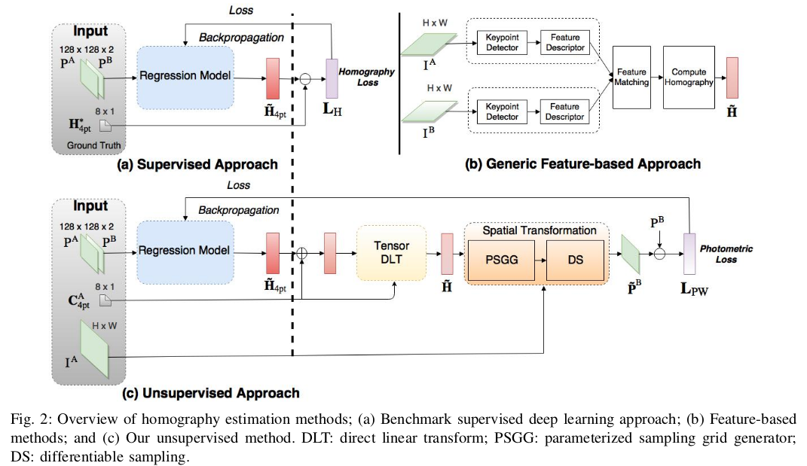

# Homography Net



In this project, we aim to implement a deep learning framework to learn the underlying homography between two images. The approach takes inspiration from the following references:

[1]DeTone, D., Malisiewicz, T., & Rabinovich, A. (2016). Deep image homography estimation. arXiv preprint arXiv:1606.03798.

[2]Nguyen, T., Chen, S. W., Shivakumar, S. S., Taylor, C. J., & Kumar, V. (2018). Unsupervised deep homography: A fast and robust homography estimation model. IEEE Robotics and Automation Letters, 3(3), 2346-2353.

## Scripts

Supervised training script: <br />
&ensp;&ensp;&ensp;&ensp;```./notebook/train_supervised.ipynb``` <br />
Unsupervised training script: <br />
&ensp;&ensp;&ensp;&ensp;```./notebook/train_unsupervised.ipynb``` <br />
Visualize performance: <br />
&ensp;&ensp;&ensp;&ensp;```./notebook/visualization.ipynb``` <br />
Quantify performance:<br />
&ensp;&ensp;&ensp;&ensp;```./notebook/performance.ipynb``` <br />

## Environment

Required packge: <br />
tensorflow 2.15 <br />
pillow 10.2.0 <br />
opencv-python 4.9.0.80 <br />

## Model checkpoint
The checkpoints of the supervised and unsupervised model can be found [here](https://www.dropbox.com/scl/fo/tywx25upu76x4hbgzfqbu/h?rlkey=wc5gjy48dd7vu272c2bmoc87f&dl=0)

## Architecture


The above shows the architecture of our model. We use VGG19 as the backbone to encode the two image patches, which are related through a homography that is generated from perturbing the corner coordinates randomly. The output from one of the intermediate convolution layer, i.e., "block3_conv4", is used for downstream processing.

First, the backbone outputs from the two image patches are concatenated channel-wise. Next, the output goes through 7 inception blocks, to further extract spatial information. Inception blocks are used for their multi-resolution encoding capability. The output is then further processed through the rest of the network, including the final MLP layers that produce the 1 by 8 vector that contains the predicted x and y coordinates of the shifted corners. 

## Dataset

This process to generate training data is illustrated below.


On the left, the yellow region is randomly selected and 4 corners are shifted randomly to produce the region outlined in blue. The homography maps from the blue region to the yellow region, which generates the two patches shown in the middle. These two patches are the input to the network, whose output predicts the 4 corners of blue region. The 4 corners can be then used to reconstruct the actual homography matrix. 

On the right, the example output from the network is shown, which predicts the actual corners with high accuracy.

The images used for training, validation and testing are a subset of the COCO dataset. 

## Training

We followed the ***supervised*** and ***unsupervised*** approach as outlined in reference [2] (see the figure below from the same reference)



In the ***supervised*** training, the loss comes from the L2 difference between the ground truth corner coordinates and the predicted corner coordinates.

In the ***unsupervised*** training, the predicted corner coordinates are passed through differentiable module TensorDLT and Spatial Transformer to produce the predicted warped image. The L1 difference between the predicted image and the ground truth image, i.e., ***photometric loss*** serves as the source for backpropagation.

The parameter $\rho$ controls the amount of random shift in the corner coordinate ($\Delta x$ and $\Delta y$ are uniform over $[-\rho, \rho]$). We first train the network with $\rho=16$, and move on to $\rho=32$ once the previous training performance plateaus. This training schedule generally produces better results than training only with $\rho=32$.

## Performance

The example performances from the supervised and unsupervised training are shown below. The original crop regions are shown in the left column. The middle columns shows the output of the ***supervised*** model. The right column shows the output of the ***unsupervised*** model. In general, the supervised model seems to outperform the unsupervised model. 


The quantitative results are summarized below. The error refers to the L2 distance between ground truth corner and predicted corner. 

| Model       | Training L2     | Validation L2    |  Test L2        |
| :---        |    :----:       |     :----:       |    :----:       |
| Supervised  | 5.15 $\pm$ 2.45 | 5.17 $\pm$ 2.44  | 5.23 $\pm$ 2.62 |
| Unsupervised| 10.20 $\pm$ 4.74| 9.99 $\pm$ 4.92  | 10.21 $\pm$ 4.85|
